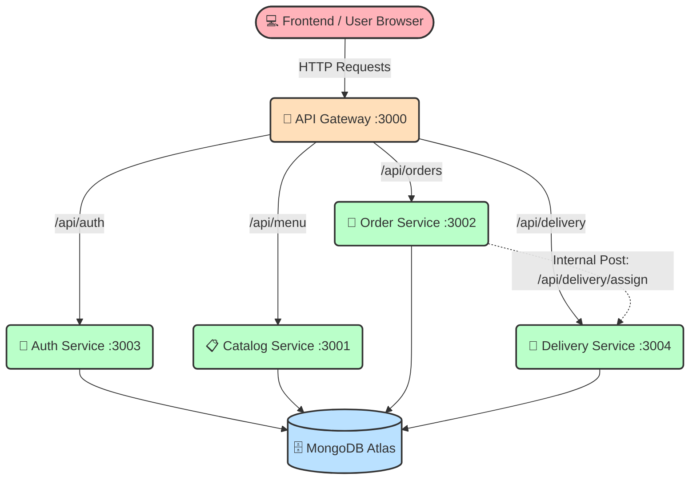

<div align="center">
  
  <h1>🍔 Yo-Eats Food Delivery Platform</h1>
  <p><strong>A modern, highly scalable food ordering platform powered by a robust Microservices Architecture.</strong></p>

  [](https://nodejs.org/)
  [](https://expressjs.com/)
  [](https://mongodb.com)
  [](https://docker.com)
</div>

---

## 🌟 Features Overview
- **Dynamic Menu Catalog**: Food items are fetched dynamically from a dedicated catalog service and seeded automatically.
- **Secure Authentication**: JWT-based registration and login system with encrypted sessions.
- **Real-time Order Processing**: Generates unique order IDs and manages cart checkout.
- **Live Delivery Tracking**: Autonomous delivery service that tracks driver assignment and ETA.
- **API Gateway**: A single entry point that seamlessly proxies frontend traffic to backend services.
- **Containerized**: 100% Dockerized for easy deployment and scalability.

---

## 🏗️ Microservices Architecture

Yo-Eats is entirely decoupled. It separates concerns into individual, highly cohesive microservices that communicate over a private network. 



### 🧩 The Services
| Service | Port | Description | Tech Stack |
|---------|------|-------------|------------|
| **API Gateway** | `3000` | Routes traffic to the correct microservice. | Node, HTTP-Proxy |
| **Catalog** | `3001` | Handles fetching and seeding the food menu. | Express, Mongoose |
| **Order** | `3002` | Processes shopping carts and initiates delivery. | Express, Mongoose |
| **Auth** | `3003` | Validates users and issues JSON Web Tokens. | Express, JWT |
| **Delivery** | `3004` | Tracks live delivery statuses and driver ETAs. | Express, Mongoose |
| **Frontend** | `8080` | Client-facing UI served via NGINX. | HTML, CSS, JS |

---

## 🚀 How to Run Locally

### Prerequisites
- [Docker Desktop](https://www.docker.com/products/docker-desktop/) installed on your machine.
- A free [MongoDB Atlas](https://www.mongodb.com/cloud/atlas/register) cluster.

### Startup Instructions

1. **Clone the repository:**
   ```bash
   git clone https://github.com/YOUR_USERNAME/Yo-Eats.git
   cd Yo-Eats
   ```

2. **Set your Database:**
   Update the `MONGO_URI` environment variable in the `docker-compose.yml` file to your personal MongoDB Atlas connection string.

3. **Spin up the Architecture:**
   ```bash
   docker-compose up --build
   ```

4. **Enjoy!**
   Open your browser and navigate to `http://localhost:8080`.

---
<div align="center">
  <i>Built with ❤️ for a seamless food delivery experience.</i>
</div>
